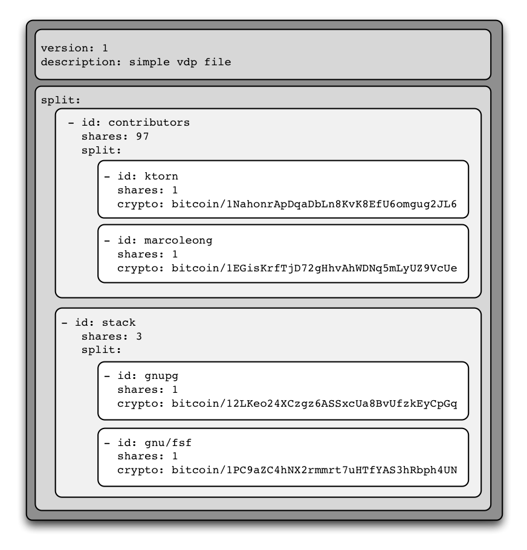
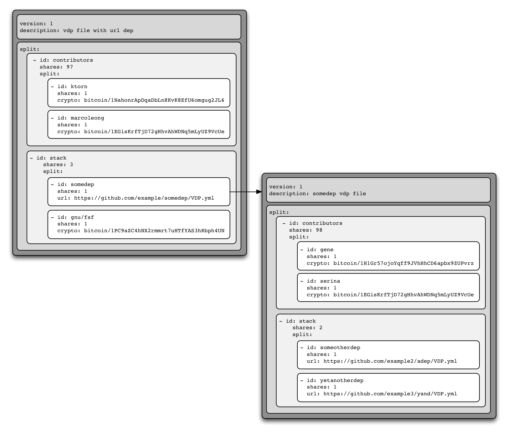
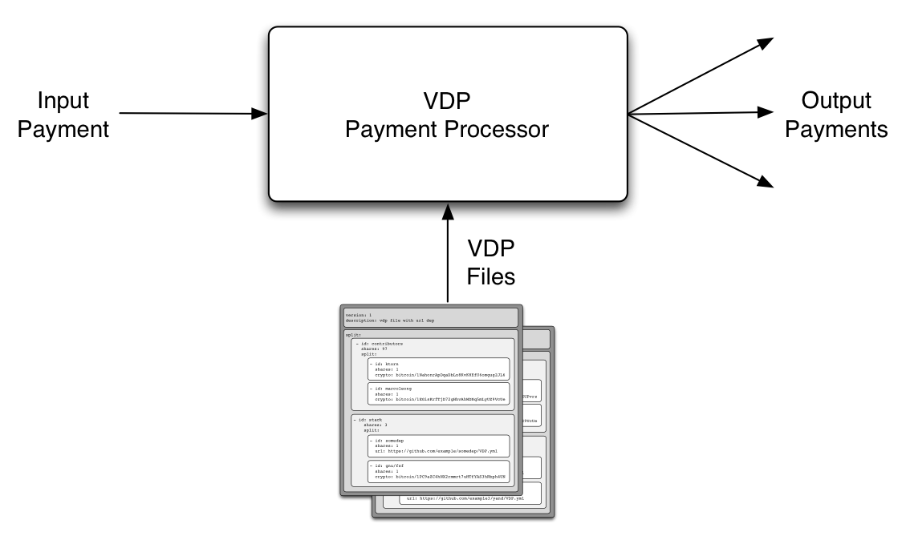
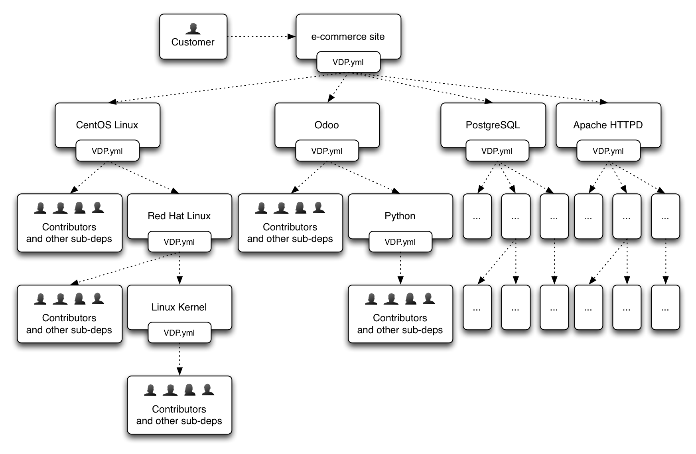

#Value Distribution Protocol (VDP)

##News

**31 May 2015** - The first VDP transaction. Hackcoin's first prize (1 BTC) was [awarded](https://blockchain.info/tx/d0b6d74e5aa2878b1b0ddb5efcf547ff0b4d4e7803fbec17f576e6a9c16d9593) and automatically [distributed](https://blockchain.info/tx/d361c67cde43f6538fa92a50177a0600c704172c4abfe4dabe457eb14c949539) to the team using our [demo VDP file](https://github.com/macausource/subsatoshi/blob/hackathon/examples/hackathon-prize.yml).

3% of the total award amount was donated towards the OSS stack ([Free Software Foundation](http://www.fsf.org) and [GnuPG](https://www.gnupg.org/)).

--

**23 May 2015** - This project won first prize at [Hackcoin 2015](https://www.bitcoinhk.org/2015-hackcoin-results/), Hong Kongs's first blockchain hackathon.

---

##About VDP

VDP is a simple protocol that defines how value should be divided amongst various stakeholders.

### VDP Configuration Files

The core element of the protocol is the *VDP configuration file*, which defines stakeholders and their relative value allocation.

The `shares` of a stakeholder are relative to its sibling stakeholders. In the above example, the sibling stakeholders `ktorn` and `marcoleong` each have 1 share, which means they split 50% of the value attributed to `contributors`, which itself is 97% of the overall value.

Stakeholders can have their value paid directly to `crypto`currency addresses, such as `bitcoin`, or according to separate VDP files linked via the `url` keyword. This effectively creates hyperlinked VDP files.

The simplicity of the protocol, coupled with the linking of VDP files is very powerful.

### VDP Payment Processors

A VDP file is not very useful unless it is actually used to make payments.

A VDP payment processor simply takes one or more VDP files as input, and for each incoming payment, splits the value according to those file(s) and makes actual outgoing payments as applicable.

##Use Cases

###Free and Open Source Software (FOSS) Funding

Many for-profit projects, especially software, depend on a variety of open source projects. The creators of these businesses and projects know this, yet cannot identify who they should donate to, given the huge variety of projects and their contributors.

In this context VDP can be used to fairly distribute donations to the open source stack. Each company simply needs to define their top-level stack, and link to the various projects' existing VDP files.

Each project will take care of maintaining their own VDP files, attributing credit to both sub-dependencies, as well as direct contributors.

In an ideal scenario, e-commerce sites can automatically donate small percentages of incoming sales, with each sale triggering a cascade of VDP payments resulting in automatic micropayments to the developers of the stack, who will benefit from a new *recurring revenue stream*.

One of the best aspects of this approach is that "invisible" projects which are often underfunded but are essencial to many stacks, such as [OpenSSL](https://www.openssl.org/) and [GPG](https://www.gnupg.org/), will get fairly rewarded.

This use case was presented at [HackCoin 2015](https://www.bitcoinhk.org/2015-hackcoin-results/) and the prize money (1 BTC) was [instantly distributed](https://blockchain.info/tx/d361c67cde43f6538fa92a50177a0600c704172c4abfe4dabe457eb14c949539) using a [basic implementation](https://github.com/macausource/subsatoshi/tree/hackathon) of the protocol, which included a 3% donation towards both [GPG](https://www.gnupg.org/) and the [Free Software Foundation](http://www.fsf.org).

##Implementations

* [http://subsatoshi.org](http://subsatoshi.org) - currently only contains the [PoC code](https://github.com/macausource/subsatoshi/tree/hackathon) used at the hackathon.

---

###TODOs:
* Add more examples and use cases

---

Previously known as: [*"Cascading Revenue Sharing Protocol" (CRSP)*](https://github.com/ABISprotocol/ABIS/issues/1) and [*"Value Chain Distribution Protocol" (VCDP)*](https://github.com/ktorn/vcdp)
